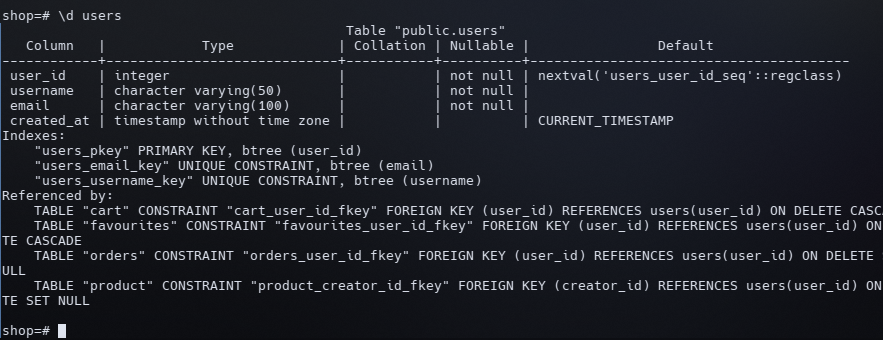
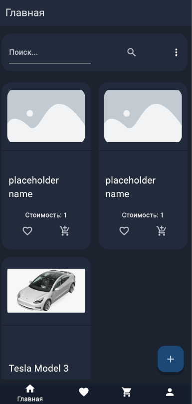
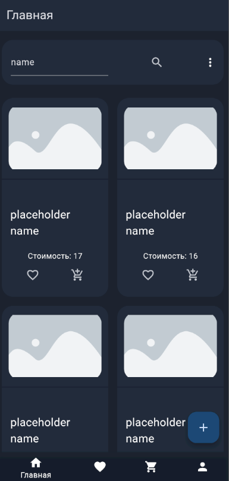

# Программирование корпоративных систем практика 12 Журавлев Владимир ЭФБО-02-22

Суть работы состояла в привязке id пользователя к товарам, а также в добавлении сортировки и поиска товаров

На данный момент в models/user.dart хранится глобальная переменная, содержащая в себе информацию об авторизованном пользователе. Было бы проще сделать это через Firebase, но на тот момент сервис не использовался

При создании товара в бд также записывается id пользователя, создавшего его, что используется в последствии

Так, только создатель товара может удалить его с площадки

Создали новый товар - так как авторизованный пользователь - создател товара, он имеет право удалить его

Та же страница, но с другого аккаунта

Запись в БД

Второй частью работы была реализация поиска и сортировки, эта задача была выполнена посредством создания нового запроса в бекенде

Поиск

Сортировка

По стоимости по возрастанию

По стоимости по убыванию

В алфавитном порядке

Также можно сортировать и одновременно применять поиск
На скриншоте ниже сортировка по стоимости по убыванию

